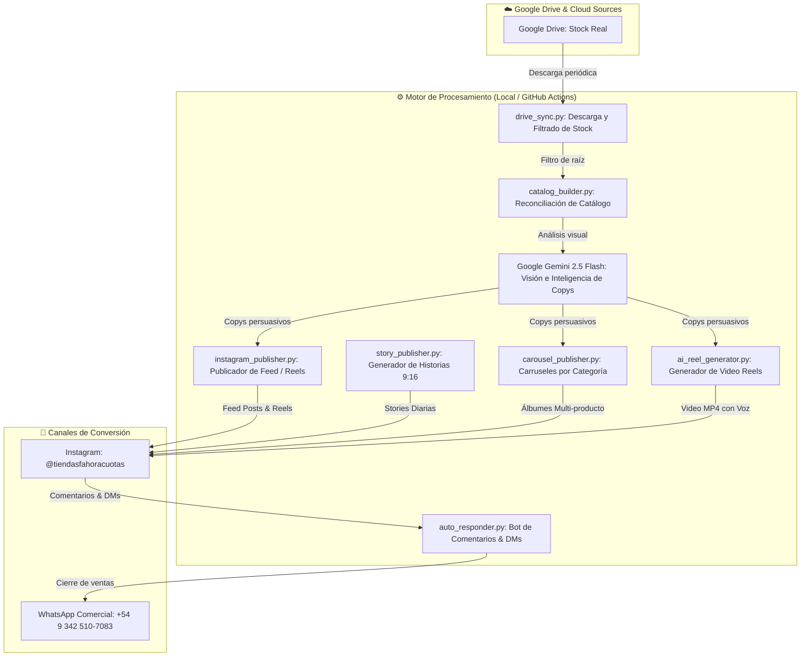

# 🚀 Ahora Cuotas — Instagram Sales Automation & Cloud Autopilot

Sistema integral de automatización para venta directa financiada en Instagram, sincronización de inventario en tiempo real desde Google Drive, generación de copys con **Google Gemini 2.5 Flash Vision**, creación de Reels con IA y captura automática de leads hacia **WhatsApp**.

---

## 🏗️ Arquitectura del Sistema



---

## ✨ Características Principales

### 1. 🔄 Sincronización Inteligente de Stock (Google Drive)
* **Regla estricta de stock real:** Filtra automáticamente y toma únicamente los archivos en la raíz principal de cada categoría.
* **Exclusión de agotados:** Ignora subcarpetas (`agotado/`, `FOTOS REALES/`, `historias de ig/`). Si un producto se agota y se mueve a `agotado/`, el bot lo excluye de la cola.

### 2. 🧠 Copywriting Visual con Google Gemini 2.5 Flash
* Analiza cada imagen a nivel de píxeles antes de publicarla.
* Reconoce el producto específico (marcas, modelos, tipos de electrodomésticos o vehículos) y genera descripciones de venta directa en tono argentino con requisitos (*Solo con DNI + Servicio*), cuotas (*diarias, semanales o mensuales*) y llamado a la acción.

### 3. 🎬 Generador de Reels con IA
* Transforma fotos estáticas en videos verticales 9:16 (1080x1920) de alta definición.
* Locución comercial con **Google TTS** y animación suave (*Ken Burns Zoom*) mediante **MoviePy**.

### 4. 📸 Historias Automáticas (Stories 9:16)
* Genera historias verticales de alto impacto con diseño enmarcado, encabezado de marca y botones de contacto.

### 5. 🤖 Lead Auto-Responder (Cierre a WhatsApp)
* Monitorea comentarios con palabras clave (*"precio"*, *"info"*, *"cuotas"*, etc.) y DMs.
* Responde públicamente y envía un mensaje privado con el enlace directo al chat de WhatsApp (`https://wa.me/5493425107083`) para que los potenciales clientes no se enfríen.

### 6. ☁️ Ejecución 24/7 Gratuita en GitHub Actions
* Flujo de trabajo programado cada 2 horas sin necesidad de servidores pagos ni computadoras encendidas.
* Auto-persistencia de base de datos (`posts.json` y `responded_leads.json`) sincronizada automáticamente con el repositorio.

---

## 📁 Estructura del Proyecto

```text
├── .github/
│   └── workflows/
│       └── instagram_autopilot.yml # Flujo de GitHub Actions (Cron 2h)
├── Assets/                         # Carpeta sincronizada de categorías y fotos
├── reels_output/                   # Videos Reels generados con IA
├── temp_stories/                   # Historias temporales generadas
├── ai_reel_generator.py            # Generador unitario de Reels (Gemini + TTS + MoviePy)
├── batch_reel_generator.py         # Generador masivo de Reels por lote/categoría
├── auto_pilot.py                   # Orquestador local continuo
├── auto_responder.py               # Bot de captura de leads en comentarios y DMs
├── carousel_publisher.py           # Publicador de carruseles multi-producto
├── catalog_builder.py              # Constructor y reconciliador de catálogo
├── drive_sync.py                   # Sincronizador desde enlace público de Google Drive
├── export_session_secret.py        # Exportador de cookies para GitHub Secrets
├── github_runner.py                # Ejecutor del ciclo único para GitHub Actions
├── instagram_publisher.py          # Motor de conexión y publicación con instagrapi
├── login_helper.py                 # Asistente de inicio de sesión con cookies del navegador
├── posts.json                      # Base de datos local de publicaciones e historial
├── responded_leads.json            # Registro de interacciones respondidas
├── requirements.txt                # Dependencias de Python
└── .env.example                    # Plantilla de variables de entorno
```

---

## ⚙️ Configuración de Variables de Entorno (`.env`)

| Variable | Descripción | Ejemplo |
| :--- | :--- | :--- |
| `IG_USERNAME` | Usuario de la cuenta de Instagram | `tiendasfahoracuotas` |
| `IG_PASSWORD` | Contraseña de Instagram | `********` |
| `IG_SESSION_FILE` | Nombre del archivo local de sesión | `session.json` |
| `GEMINI_API_KEY` | Clave de API de Google AI Studio | `AIzaSy...` |
| `GOOGLE_DRIVE_FOLDER_URL` | Enlace a la carpeta compartida de Google Drive | `https://drive.google.com/...` |
| `POSTING_INTERVAL_MINUTES`| Minutos de espera entre posts en modo continuo | `20` |
| `SYNC_INTERVAL_HOURS` | Intervalo de sincronización con Drive (horas) | `6` |
| `STORY_INTERVAL_HOURS` | Intervalo de publicación de Historias (horas) | `2` |
| `LEAD_CHECK_MINUTES` | Intervalo de chequeo de comentarios y DMs (min) | `10` |

---

## 🛠️ Guía de Comandos y Uso

### 1. Iniciar Sesión de Instagram (Sin bloqueos)
```bash
python login_helper.py
```
*Pide el `sessionid` desde las cookies del navegador para evitar desafíos de seguridad.*

### 2. Exportar Sesión para GitHub Actions
```bash
python export_session_secret.py
```
*Genera `session_secret_for_github.txt` para copiar en el secret `IG_SESSION_B64` de GitHub.*

### 3. Sincronizar Stock de Google Drive
```bash
python drive_sync.py
```

### 4. Ejecutar Autopilot Local
```bash
python auto_pilot.py
```
*(O doble clic en `iniciar_autopilot.bat` en Windows).*

### 5. Generar Reels con IA
```bash
# Generar 5 Reels con IA
python batch_reel_generator.py --count 5

# Generar Reels para una categoría específica
python batch_reel_generator.py --category Motos --count 3
```

### 6. Publicar Carrusel por Categoría
```bash
python carousel_publisher.py --category "Celulares y Tablet"
```

---

## 🛡️ Seguridad y Buenas Prácticas
* **Sin contraseñas en texto plano en la nube:** Los secretos se administran a través de GitHub Actions Encrypted Secrets.
* **Intervalos anti-spam:** Cada publicación tiene intervalos configurables con variaciones aleatorias para simular interacción humana y prevenir limitaciones de cuenta.
* **Persistencia de sesión:** Reutilización de cookies para evitar solicitudes excesivas al endpoint de autenticación.
